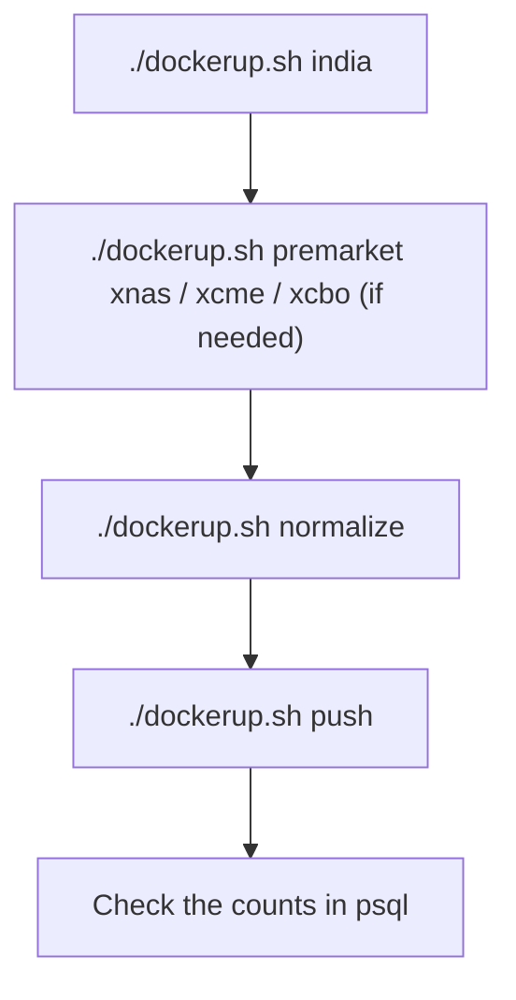
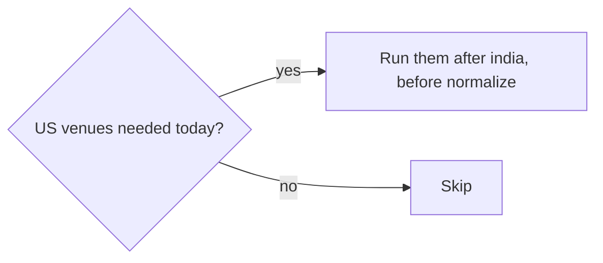
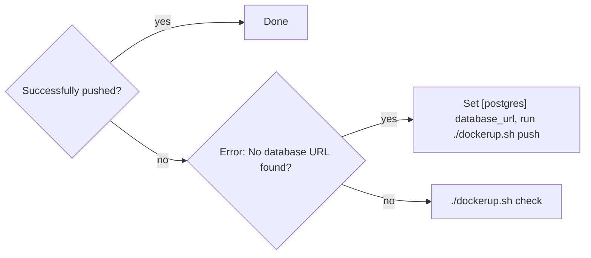
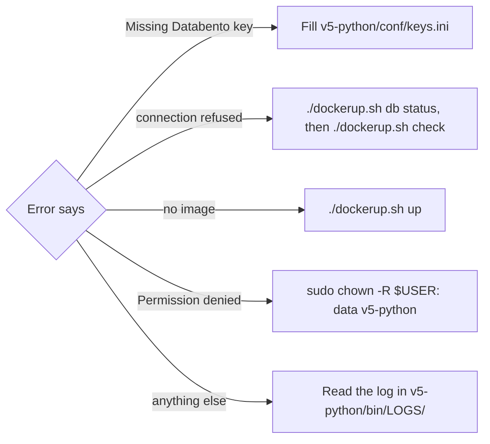

# Runbook

Every morning before market open. One-time setup: [SETUP.md](SETUP.md).

```sh
cd Securities
```

## Daily run



```sh
./dockerup.sh india          # premarket india
./dockerup.sh normalize      # premarket normalize
./dockerup.sh push           # premarket normalize --only postgres
```

Or all three in one go (india, then normalize with the push):

```sh
./dockerup.sh daily
```

## US venues



```sh
./dockerup.sh premarket xnas
./dockerup.sh premarket xcme
./dockerup.sh premarket xcbo
```

## Did the push work?

The last line of `push` must be:

```text
Successfully pushed to v4_YYYYMMDD, v4_YYYYMMDD_baskets, public
```



## Check it landed

```sh
./dockerup.sh db psql
```

```sql
select exchange, count(*) from v4_20261001.contracts group by exchange;
select count(*) from v4_20261001_baskets.baskets;
```

Every venue you downloaded has a non-zero count. There are 15 baskets.

## Command map

| dockerup | premarket | Writes |
|----------|-----------|--------|
| `./dockerup.sh india` | `premarket india` | `data/YYYYMMDD/raw/FYERS/` |
| `./dockerup.sh premarket xnas` | `premarket xnas` | `data/YYYYMMDD/raw/XNAS-DATABENTO.csv` |
| `./dockerup.sh normalize` | `premarket normalize` | `data/YYYYMMDD/normalized/`, basket contracts |
| `./dockerup.sh push` | `premarket normalize --only postgres` | `v4_YYYYMMDD.*`, `v4_YYYYMMDD_baskets.*`, `public.*` |
| `./dockerup.sh daily` | `india` + `normalize --postgres-push` | all of the above |

## Redo a past day

```sh
./dockerup.sh normalize --date-dir 20260918
./dockerup.sh push --date-dir 20260918
```

Try without writing anything:

```sh
./dockerup.sh normalize --dry-run
```

Reruns are safe: the push drops and recreates its tables.

## Only if asked

```sh
./dockerup.sh premarket normalize --plugin       # plugin CSVs + [postgres-plugin] append
./dockerup.sh strategies --strategy=str04        # STR04 1-minute bars, last 3 XNAS sessions
```

## When something fails



```sh
ls -t v5-python/bin/LOGS | head      # newest logs
./dockerup.sh status                 # image and contract DB
```

## Cron

```cron
30 7 * * 1-5  cd /path/to/Securities && ./dockerup.sh daily >> v5-python/bin/LOGS/cron.log 2>&1
```

Pick a time after the vendors publish. The default day is today in the host's time zone.
